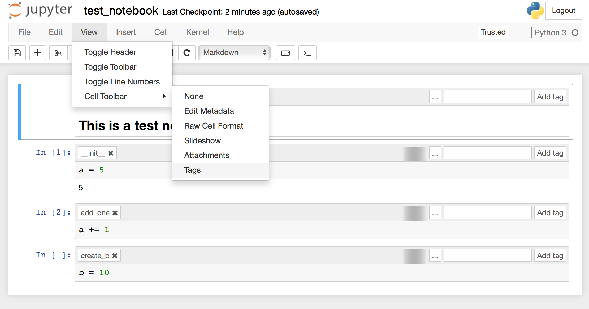

# nbloader: Treat jupyter notebooks as objects
## Reuse code from Jupyter notebooks.

To install/upgrade:
>pip install git+git://github.com/post2web/nbloader.git@master --upgrade

To run all cells from a notebook [test.ipynb](tests/test_notebook.ipynb):
```sh
from nbloader import Notebook
notebook = Notebook('test_notebook.ipynb')
notebook.run_all()
print(notebook.ns['b']) # prints out 10
```
The Notebook has its own name space and you can access it with notebook.ns
You can run individual cells using cell tags. 
Show cell tags with "View/Cell Toolbar/Tags"


To run a cell with tag add_one:
```sh
from nbloader import Notebook
notebook = Notebook('test_notebook.ipynb')
notebook.run_tag('add_one')
print(notebook.ns['a']) # 6
notebook.run_tag('add_one')
print(notebook.ns['a']) # 7
notebook.ns['a'] = 0
notebook.run_tag('add_one')
print(notebook.ns['a']) # 1
```

Other useful features:
- notebooks can be executed within global name space 
```sh
notebook = Notebook('test.ipynb', ns=globals())
```
- multiple cells could have the same tag name.
- cells taged with \_\_init\_\_ will be executed when instance of Notebook class is created
- cells taged with  \_\_del\_\_ will be executed when instance of Notebook class is deleted
- handles magic commands
- executed notebook can change working directory without affecting parent notebook
- uses relative ( ../../test.ipynb ) or full paths ( /users/notebooks/test.ipynb ) 
- uses the same process so nothing is been pickled when you pass variables
- the notebooks can be pickled
- all code is completed so Notebook methods can be called in a loop without any overhead

Best practices coming soon!